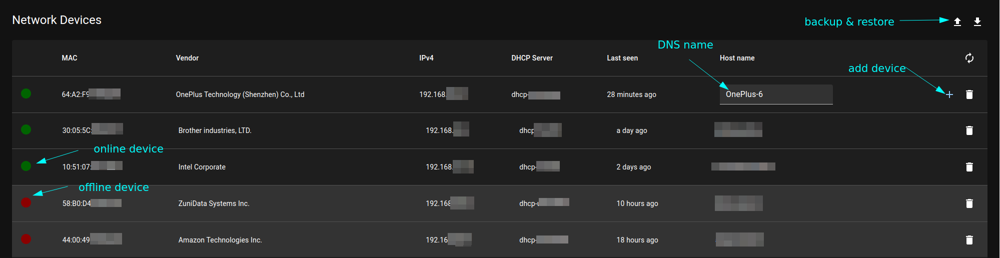

# Network Device Monitor for Mikrotik Router OS

This tool lists all devices which have been registered to your local network by DHCP
and supports providing individual host names to these devices. These host names will
be used to set DNS entries in the static DNS list  

The goal of this service is to identify and name things on your network and give them
meaningful local domain names for easier setup of lots of small clients like IoT devices.
Mikrotik routers are supported by a lease script.

*You can not rely on MAC addresses for security. So it is **not** a security feature to map MAC addresses to devices, MAC addresses can be manipulated. If you need a real secure network setup, you should setup
802.1x and RADIUS server. Intention of this application is to give an overview of your active network devices, not to add security to your network setup.*

## Features
* Find out IP of new added network devices
* Give devices meaningful names which will be used by DNS service
* See device activity and online status
* Show vendor information of MAC address helps identify devices

## Requirements
* Mikrotik RouterOS network hardware
* DHCP IPv4 service running
* DNS Service configured
* Host with docker and docker compose installed

## Installation

### Application
* Create a directory for decicemon at a file system location of your choice: `mkdir devicemon`
* `cd devicemon`
* `wget https://raw.githubusercontent.com/andreasbehnke/device-mon/main/docker-compose.yml`
* Create `.env` file in this folder. You can use `https://raw.githubusercontent.com/andreasbehnke/device-mon/main/doc/env_example` as template. You should at least set a secure password for the database!
* Secure the .env file with `chmod 0600 .env` and `chown root:root .env`
* Start application with `docker-compose up -d`
* Point your browser to `http://localhost` and you should see an empty device list

### Install Router Scripts
* Install script which will use devicemon to determine hostname for new added:
* Open Winbox and navigate to System -> Scripts
* Add new script with name `sync_leases.rsc` and the policies `read`, `write` and `test`
* Copy the script content from `https://raw.githubusercontent.com/andreasbehnke/device-mon/main/router/mikrotik/sync_leases.rsc` into source field
* Find the placeholder `[YOUR SERVICE IP]`and replace it with the IP of the fresh provisioned host
    * click `Run Script`
    * After ca. 10 seconds you should see every network device of your network in the device monitor list which has an active DHCP lease. 
* Leave dialog with OK
* Add new script with name `on_add_release.rsc` and the policies `read`, `write` and `test`
* Copy the script content from `https://raw.githubusercontent.com/andreasbehnke/device-mon/main/router/mikrotik/on_add_lease.rsc` into source field
* Find the placeholder `[YOUR SERVICE IP]`and replace it with the IP of the fresh provisioned host
* Find the placeholder `[YOUR OWN TOP LEVEL DOMAIN]` and replace it with your local top level domain, like `sweethome.local` etc. 
* Leave dialog with OK
* Open IP -> DHCP Server
* Open your DHCP Server configuration, go to tab Script
* In the tab `lease script` write the name of the lease script file `on_add_release.rsc`
* Leave dialog with OK
* Open System -> Scheduler
* Add a new scheduler with name `sync-leases` and the policies `read`, `write` and `test`
* Set interval to 00:20:00 to sync DHCP leases every 20 minutes with your devicemon application
* In the field `On Event` write the name of the sync script file `sync_leases.rsc`
* Leave dialog with OK

You can now work with the device list and give your devices meaning ful names and add them to your device database.
**The new names given will not be used until the next time the device retrieves a new DHCP lease!**

# Development
## Start from source
* cd backend
* docker-compose up
* ./mvnw spring-boot:run
* cd ../webclient
* npm install
* npm start
* see section "Install Router Scripts" for preparing your router to send lease information to your development setup. 

# References

* DHCP lease script: https://wiki.mikrotik.com/wiki/Setting_static_DNS_record_for_each_DHCP_lease
